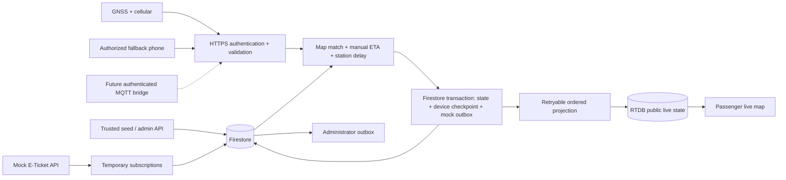

# SmartRail BD — architecture baseline v0.1

SmartRail BD is an independent academic intelligence/service layer. It does not operate trains, sell tickets, represent Bangladesh Railway, or claim an official railway connection. The available reference conversation was truncated; the detailed implementation request is the architectural source of truth.

## Scope and implemented pipeline

Train/route configuration → service journey → GPS → map matching → station ETA → boarding-station delay → fake ticket subscription → mock SMS.

The repository has two explicitly separate execution modes:

- **Standalone demo (default):** Next.js runs the shared engine in the browser. State is in memory and resets on reload. There is no identity/security claim for this sandbox and no Firebase connection. Visitors only manipulate their own fake simulation.
- **Firebase mode:** Authentication, structured Firestore reads and public RTDB subscriptions use Firebase SDKs. All mutations go through authenticated Cloud Functions or a trusted emulator-only provisioning script. The GPS simulator is a Node script calling HTTP, not a browser writing live state.

A static Next.js export works because trusted application logic lives in Cloud Functions, not Next.js route handlers. Firebase Authentication is distinct from any outer private preview access gate.

## Invariants

1. `trains/{number}` uses a permanent string Train Number; never a name or a departure as the train key.
2. Journey identity is `{trainNumber}_{YYYY-MM-DD}_{HHmm}_{routeId}_{direction}`. Local service date/time is in Asia/Dhaka; timestamps are UTC epoch milliseconds. Multiple times on one date are distinct. Crossing midnight does not change the service date. Changing a schedule produces a different service journey; actual departure is not its identifier.
3. Routes must be provisioned before a train references them. A journey embeds an immutable route/version snapshot to keep calculations stable if the route later changes.
4. Route points cover origin, destination, passenger halt, operational/crossing stop, and pass-through. Each point stores incoming segment track metres, cumulative track metres, initial segment travel minutes and dwell minutes. Distances are numeric and additive; geometry vertices carry track chainage.
5. Demo chainage is illustrative, **not exact surveyed Bangladesh railway distance**. The schema supports exact chainage. Import surveyed track geometry and authoritative distances before real use; never derive track distance from straight-line station separation.
6. Dedicated GPS is primary. Phone fallback requires a registered device, an authorized operator assigned to that journey, and at least 120 seconds since primary reception. Primary reception immediately restores preference. If no primary fix has ever arrived, fallback becomes eligible 120 seconds after scheduled departure.
7. A boarding-station subscription expires at the journey deadline. A ticket subscription is only created for a confirmed fake ticket. Manual subscribers may select origin or a passenger halt; operational points and destination are not boarding choices in this slice.
8. Alert eligibility is evaluated at the subscriber's boarding station, never from a single train-wide delay. Passed stations, expired/inactive subscriptions and completed journeys are excluded.

## Repository responsibilities

| Path                                     | Responsibility                                                                                    |
| ---------------------------------------- | ------------------------------------------------------------------------------------------------- |
| `app/page.tsx`                           | Passenger search, departure selection, live metrics, subscriptions and bounded operations console |
| `app/map.tsx`                            | Client-only Leaflet / OpenStreetMap route and train position                                      |
| `app/globals.css`                        | Tailwind entry and shared responsive interface styling                                            |
| `lib/firebase.ts`                        | Firebase client initialization, emulator connections, authenticated API calls                     |
| `shared/domain.ts`                       | Train, route, journey, GPS, ticket, subscription, device, operator and ETA provider contracts     |
| `shared/engine.ts`                       | Deterministic validation, polyline projection, progress, manual ETA and notification eligibility  |
| `shared/seed.ts`                         | Explicitly fake fixture definitions and journey/ticket construction                               |
| `functions/src/index.ts`                 | Authenticated HTTP API, transactional GPS processing and RTDB projection                          |
| `scripts/seed.ts`                        | Loopback-only emulator provisioning, test identities and device hashes                            |
| `scripts/simulate.ts`                    | Primary device simulation through secure local HTTP endpoint                                      |
| `scripts/integration.ts`                 | Emulator pipeline, concurrency, privacy and security checks                                       |
| `tests/engine.test.ts`                   | Identity, ETA, notification and GPS invariant tests                                               |
| `firestore.rules`, `database.rules.json` | Client deny-by-default authorization                                                              |

## Firestore data model

| Collection / document                              | Key and important fields                                                        | Client boundary                     |
| -------------------------------------------------- | ------------------------------------------------------------------------------- | ----------------------------------- |
| `routes/{routeId}`                                 | `version`, `direction`, `distanceQuality`, points, chainage geometry            | Public read; trusted provisioning   |
| `trains/{trainNumber}`                             | `number`, `name`, existing `routeIds`                                           | Public read; trusted provisioning   |
| `schedules/{scheduleId}`                           | Train, route, direction, scheduled local time                                   | Public read; trusted provisioning   |
| `journeys/{journeyId}`                             | Identity tuple, UTC departure/expiry, immutable route snapshot, status          | Public read; admin demo API creates |
| `settings/thresholds`                              | Delay minutes, source timeout, accuracy, corridor and speed limits              | Public read; admin threshold API    |
| `devices/{deviceId}`                               | Assignment, active state, source, SHA-256 high-entropy key hash or operator UID | Server only, including hash         |
| `operators/{uid}`                                  | Active flag, authorized journey IDs                                             | Admin read; trusted provisioning    |
| `deviceCheckpoints/{deviceId}`                     | Highest sequence and timestamp, independent of source switch                    | Server only                         |
| `liveInternal/{journeyId}`                         | Last accepted matched state, station predictions and primary source heartbeat   | Server only                         |
| `gpsHistory/{journeyId}/fixes/{deviceId_sequence}` | Raw accepted fix, matched chainage, expiry timestamp                            | Server only; seven-day TTL field    |
| `passengers/{passengerId}`                         | Fake name and fake phone                                                        | Admin read only                     |
| `tickets/{ticketId}`                               | Journey, passenger, boarding point, confirmed/cancelled status                  | Admin read only                     |
| `subscriptions/{id}`                               | Journey, boarding station, recipient, source, active flag, expiresAt            | Admin or owning UID read; API write |
| `notifications/{id}`                               | Recipient/station delay, simulated message, `mock_sent`, creation time          | Admin read only; transaction write  |

The notification ID is deterministic from journey, station and normalized fake phone. These private document paths are not exposed in the public live tree. The prototype caps a journey at 400 subscriptions to stay within a bounded transaction. This is a prototype capacity limit, not a scalable fan-out design.

RTDB: `/liveJourneys/{journeyId}` contains matched coordinate, timestamp, source, chainage, progress, next point, station predictions and completion. Device identity, sequence, primary heartbeat, passengers, phones and tickets are excluded. Public reads are granted at an individual journey path; listing the root is denied. All client writes are denied.

Firestore handles low-frequency configuration, private passenger records and durable processing. RTDB handles low-latency public delivery. Internal Firestore state adds write cost per accepted ping but provides a simple transactional consistency boundary for this first slice.

## GPS, ETA and notification algorithms

GPS validation checks registered active assignment, credential, numeric coordinate bounds, accuracy ≤100 m, timestamp within 60 seconds of server time, monotonic timestamp, per-device monotonic sequence, ≥1-second device interval, route proximity ≤500 m, forward chainage (100 m jitter tolerance), and implied speed ≤160 km/h. Device sequence must survive reboot or the device must be reprovisioned. Device secrets travel only over HTTPS in `x-device-key`; use high-entropy random keys outside local fixtures.

Map matching projects the coordinate onto each polyline segment in local metre coordinates, selects the nearest point, and interpolates surveyed chainage. It is intentionally a simple corridor matcher. Parallel tracks, loops, junction ambiguity and GNSS multipath need a later topology-aware matcher. Small backward jitter holds progress steady. A first fix cannot be speed-checked against prior movement.

Manual ETA uses the untraversed fraction of each segment's configured travel time plus downstream intermediate dwell. Scheduled station arrivals use cumulative full travel and prior dwell. Delay is `max(0, round((ETA - scheduledArrival)/60000))`. This version does not predict a recovery speed or infer unscheduled stopping dwell. Station observations and learned calibration are future work. Passed rows say “Passed”; scheduled placeholders for passed predictions are never claimed as observed arrival times.

Every accepted GPS fix evaluates eligible subscriptions. The first prediction at or above threshold emits one mock alert, including if the passenger was already delayed at first observation. The transaction stores state, checkpoint, history and new notification records together. Concurrent/retried fixes cannot create duplicate messages. A threshold change applies on the next accepted fix. New subscriptions also begin evaluation with the next fix. One alert per journey/station/recipient is deliberately stricter than cooldown-based repeated updates.

The mock service is a transactional outbox record with `status=mock_sent`; it performs **no external SMS network call**. Before adding real SMS, split eligibility/outbox from a retryable dispatcher, use provider idempotency keys and reconciliation, and add delivery/retry/dead-letter states. Do not claim exactly-once external delivery from a Firestore transaction alone.

Firestore-triggered RTDB projection may lag. It compares timestamps in an RTDB transaction so out-of-order trigger invocations cannot regress state. Firestore is authoritative if RTDB is unavailable. History is retained for later segment observations and an interchangeable `EtaProvider`; there is no ML implementation or accuracy claim.

## Security boundaries and operational limits

- Firebase ID tokens are verified on the server. Only trusted custom claim `admin: true` permits mock imports, demo journey creation and threshold changes. A hidden button is not an authorization boundary.
- Phone GPS requires UID/device/journey binding and active operator membership. Device keys never enter the browser bundle. Both transports use the same service; MQTT is only an adapter contract in this version, not an installed broker.
- Public structured documents contain no passenger PII. Client direct writes are denied, including for admin users; the Admin SDK owns validation and mutations.
- The seed script refuses non-loopback emulator addresses and always uses `demo-smartrail-bd`. Demo user passwords/device keys are public local fixtures and must never be reused in a real project.
- The cloud `DEMO_MODE=true` flag explicitly enables fake ticket and subscription endpoints. Without it (or emulators), these endpoints reject writes. Only reserved fake phone format `+880100000xxxx` is accepted for manual subscriptions. Real phone verification and consent are deferred.
- Transport CORS is enabled for configurable static frontends; it is not authentication. Before internet device rollout add an API gateway rate/abuse limit, app attestation for passenger endpoints, narrow allowed origins, monitoring, key rotation, and operator provisioning/audit workflows. The implemented device checkpoint is an accepted-ping rate limit, not DDoS protection.
- Full admin CRUD, schedule calendars, ticket cancellation updates, unsubscribe UI, production device provisioning, notification delivery, observed station events, learned ETA and real railway data are deliberately outside phase 1.

## Phased implementation

| Phase                                   | Deliverable and acceptance gate                                                                                                                                                                                                               |
| --------------------------------------- | --------------------------------------------------------------------------------------------------------------------------------------------------------------------------------------------------------------------------------------------- |
| **1 — this repository**                 | Runnable demo + emulator backend; same-day identity, mock ticket subscriptions, validated GPS, live map, ETA, boarding-specific duplicate-safe mock alerts; unit/build/emulator checks                                                        |
| **2 — administration and data quality** | Audited route/train/schedule/device/operator CRUD; route-before-train validation in all write APIs; surveyed geometry import/versioning; cancellations, unsubscribe and lifecycle jobs; simulator controls for fallback                       |
| **3 — operational pilot**               | Hardware GNSS integration; authenticated TLS MQTT bridge and per-topic ACLs; staging deployment, abuse controls, monitoring, device key rotation, authoritative station observations, source freshness UX, real SMS provider test environment |
| **4 — historical calibration**          | Segment/dwell aggregates by route version/time band; robust outlier handling and fallback; evaluate MAE at each station against held-out journeys                                                                                             |
| **5 — authorized integrations / ML**    | Authorized Railway API contract, verified ticket identity/consent and retention; versioned model behind EtaProvider; shadow evaluation and rollback before passenger use                                                                      |

## Primary implementation references

- [Next.js static exports](https://nextjs.org/docs/app/guides/static-exports)
- [Firebase HTTP functions](https://firebase.google.com/docs/functions/http-events)
- [Firebase Local Emulator Suite](https://firebase.google.com/docs/emulator-suite)
- [Authentication emulator](https://firebase.google.com/docs/emulator-suite/connect_auth)

The locked dependency versions and locally installed Next.js documentation were also checked during implementation.
